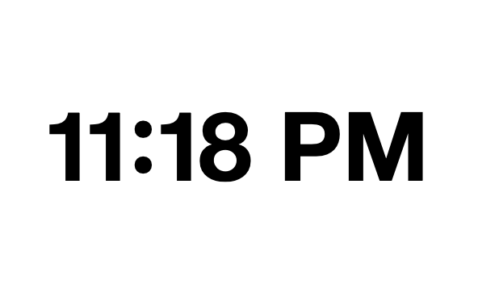
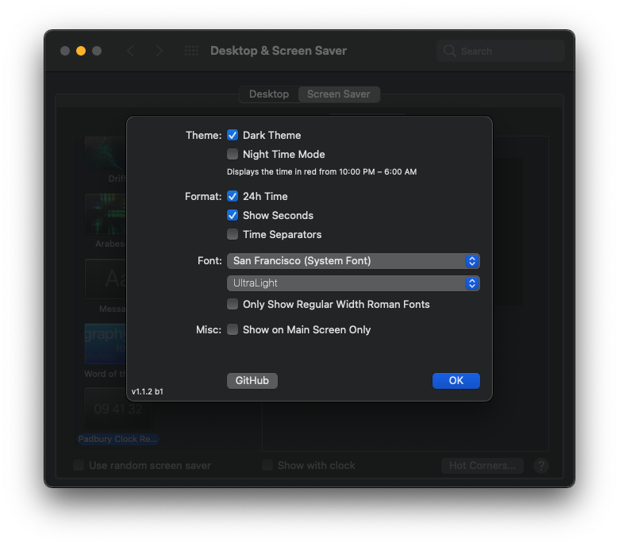

# Padbury Clock Revived

The [Padbury Clock](https://padbury.app) is a minimalist screensaver created by [Robert Padbury](https://twitter.com/Padbury).
It has not been updated in ages and actually broke for me during the Big Sur beta cycle (although that issue resolved itself).
At that point I decided to recreate it.
This new version retains most of the settings from the original (if you require the red mode feel free to add a pull request) and ads a new font family and font weight selection system.
The original screensaver used Helvetia Neue Ultra Light.
With the new version you will also be able to select San Francisco, Apple's new system font as the font used.

## License

This project is licensed under the [MIT license](LICENSE.md).

I could not get in touch with Robert Padbury about the intellectual property rights for his original screensaver.